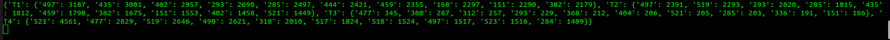

# kafka_project
Kafka project for AUEB MSc Digital Infrastructure Technologies course

# Prerequisites
In order to run the project a zookeper/kafka environment must be set up as described here
https://www.digitalocean.com/community/tutorials/how-to-install-apache-kafka-on-ubuntu-20-04

A running Minio server is also needed which can be set up as described here 
https://linuxhint.com/installing_minio_ubuntu/

# Installation

Create the needed Kafka Topics, exctract and rename the dataset by simply running the given script
```sh
./preparation.sh
```

# Results for the provided dataset

## Question 1

Q1 - Q4 are the quadrants around the given center and the value next to them is the number of trips starting from it


## Question 2

T1 - T4 are the four given intervals and the values correspodin to each are pairs of "station ids" and "number of trips" starting from the stations in the time interval. The results are sorted in descending order.


